# 09 📱 OFFLINE TIMBRATURE - BadgeNode

**Sistema offline-first per timbrature con sincronizzazione automatica**  
**Versione**: 5.0 • **Data**: 2025-10-21 • **Stato**: Enterprise Stable

---

## 📋 Contenuti

1. [Overview Sistema](#overview-sistema)
2. [Architettura e Flusso](#architettura-e-flusso)
3. [Configurazione e Setup](#configurazione-e-setup)
4. [Implementazione Database](#implementazione-database)
5. [Client-Side Integration](#client-side-integration)
6. [Rollout e Sicurezza](#rollout-e-sicurezza)
7. [Testing e Acceptance](#testing-e-acceptance)

---

## 🎯 Overview Sistema

### **Obiettivo**
Permettere timbrature offline su dispositivi tablet aziendali con sincronizzazione automatica quando la connessione torna disponibile, mantenendo idempotenza e zero regressioni UI/UX.

### **Principi Chiave**
- **Default OFF**: Sistema disabilitato di default, attivabile solo su device whitelisted
- **Zero Impact**: Nessuna modifica UI/UX quando disattivato
- **Idempotenza**: Prevenzione duplicati tramite unique constraints
- **Kill-switch**: Disattivazione immediata tramite configurazione
- **Tree-shake Safe**: Nessun import attivo quando feature OFF

### **Step Evolutivi Completati**
1. **Step 1**: Scaffolding client, feature flags, diagnostica base
2. **Step 2**: Database schema, RPC idempotente, migrazioni
3. **Step 3**: Coda persistente IndexedDB, sync FIFO
4. **Step 4**: Rollout per-device, whitelist, timeout/backoff
5. **Step 5**: Acceptance pilota, micro-badge opzionale
6. **Enterprise Final**: Consolidamento e cleanup

---

## 🏗️ Architettura e Flusso

### **Diagramma Sequenza**

```mermaid
sequenceDiagram
  participant UI as Tastierino (immutato)
  participant SVC as TimbratureService
  participant Q as IndexedDB Queue
  participant RPC as insert_timbro_offline

  UI->>SVC: timbra(pin,tipo)
  alt Feature OFF o rete OK
    SVC->>RPC: percorso attuale (server endpoint)
    RPC-->>SVC: esito
  else Feature ON & rete down/errore
    SVC->>Q: enqueue({device_id, client_seq, ...})
    SVC->>SVC: runSyncOnce() (fire-and-forget)
  end
  Note over SVC,Q: installSyncTriggers() su online/visibilitychange
  SVC->>RPC: Sync FIFO (pending → sending)
  alt OK
    RPC-->>SVC: {status:OK}
    SVC->>Q: markSent+remove
  else ALREADY_EXISTS
    RPC-->>SVC: {status:ALREADY_EXISTS}
    SVC->>Q: remove (idempotenza)
  else REVIEW_REQUIRED
    RPC-->>SVC: {status:REVIEW_REQUIRED}
    SVC->>Q: markReview
  else ERROR/rete down
    RPC-->>SVC: errore
    SVC->>SVC: break (no martellamento)
  end
```



### **Componenti Principali**

```
Device → Coda locale (IDB/fallback in-memory) → Sync Runner → RPC insert_timbro_offline → Supabase
```

- **Device ID**: Identificativo univoco persistente per dispositivo
- **Client Sequence**: Contatore locale per garantire ordinamento
- **IndexedDB Queue**: Coda persistente con fallback in-memory
- **Sync Runner**: Gestore sincronizzazione con backoff e retry
- **RPC Idempotente**: Endpoint server per inserimento sicuro

---

## ⚙️ Configurazione e Setup

### **Variabili Environment**

```bash
# Offline (global flag OFF di default)
VITE_FEATURE_OFFLINE_QUEUE=false

# Lista device autorizzati (CSV)
VITE_OFFLINE_DEVICE_WHITELIST=""

# Badge opzionale di diagnostica (default OFF)
VITE_FEATURE_OFFLINE_BADGE=false

# Versione app (opzionale, per diagnostica)
VITE_APP_VERSION="2025.10.21-enterprise"
```

### **Configurazioni per Ambiente**

#### **Produzione**
```bash
VITE_FEATURE_OFFLINE_QUEUE=false
VITE_OFFLINE_DEVICE_WHITELIST=""
VITE_FEATURE_OFFLINE_BADGE=false
```

#### **Staging/Pilota**
```bash
VITE_FEATURE_OFFLINE_QUEUE=true
VITE_OFFLINE_DEVICE_WHITELIST="tablet-123,tablet-xyz"
VITE_FEATURE_OFFLINE_BADGE=true  # Solo per QA
```

#### **Sviluppo**
```bash
VITE_FEATURE_OFFLINE_QUEUE=true
VITE_OFFLINE_DEVICE_WHITELIST="dev-local"
VITE_FEATURE_OFFLINE_BADGE=true
```

### **Attivazione in Sviluppo**

1. Aggiungi al tuo `.env.local`:
   ```bash
   VITE_FEATURE_OFFLINE_QUEUE=true
   ```

2. Riavvia dev server

3. Verifica in DevTools Console:
   ```js
   window.__BADGENODE_DIAG__
   // → { offline: { enabled: true, deviceId: "...", queueCount: 0, ... } }
   ```

---

## 🗄️ Implementazione Database

### **Migrazioni Create**

#### **Colonne Offline (20251021T1315)**
```sql
-- Aggiunge colonne nullable su public.timbrature
ALTER TABLE public.timbrature 
ADD COLUMN IF NOT EXISTS device_id text,
ADD COLUMN IF NOT EXISTS client_seq bigint;

-- Commenti esplicativi
COMMENT ON COLUMN public.timbrature.device_id IS 'ID dispositivo per timbrature offline';
COMMENT ON COLUMN public.timbrature.client_seq IS 'Sequenza client per idempotenza offline';

-- Indice UNIQUE parziale per idempotenza
CREATE UNIQUE INDEX IF NOT EXISTS uq_timbrature_device_seq
ON public.timbrature (device_id, client_seq)
WHERE device_id IS NOT NULL AND client_seq IS NOT NULL;
```

#### **RPC Idempotente (20251021T1320)**
```sql
CREATE OR REPLACE FUNCTION public.insert_timbro_offline(
  p_device_id text,
  p_client_seq bigint,
  p_pin text,
  p_tipo text,              -- 'entrata' | 'uscita'
  p_timestamp_raw timestamptz
) RETURNS jsonb
SECURITY DEFINER
SET search_path = public
LANGUAGE plpgsql
AS $$
DECLARE
  v_pin_int integer;
  v_user_exists boolean;
  v_giorno_logico date;
  v_data date;
  v_ore time;
  v_timbro_id bigint;
BEGIN
  -- Validazione PIN
  v_pin_int := p_pin::integer;
  SELECT EXISTS(SELECT 1 FROM public.utenti WHERE pin = v_pin_int) INTO v_user_exists;
  
  IF NOT v_user_exists THEN
    RETURN jsonb_build_object('status', 'ERROR', 'reason', 'PIN non valido');
  END IF;

  -- Calcolo giorno logico (cutoff 05:00)
  v_data := (p_timestamp_raw AT TIME ZONE 'Europe/Rome')::date;
  v_ore := (p_timestamp_raw AT TIME ZONE 'Europe/Rome')::time;
  
  IF v_ore < '05:00:00'::time THEN
    v_giorno_logico := v_data - INTERVAL '1 day';
  ELSE
    v_giorno_logico := v_data;
  END IF;

  -- Inserimento idempotente
  INSERT INTO public.timbrature (
    pin, tipo, data, ore, giornologico, 
    device_id, client_seq, created_at
  ) VALUES (
    v_pin_int, p_tipo, v_data, v_ore, v_giorno_logico,
    p_device_id, p_client_seq, p_timestamp_raw
  )
  ON CONFLICT (device_id, client_seq) DO NOTHING
  RETURNING id INTO v_timbro_id;

  IF v_timbro_id IS NOT NULL THEN
    RETURN jsonb_build_object('status', 'OK', 'timbro_id', v_timbro_id);
  ELSE
    RETURN jsonb_build_object('status', 'ALREADY_EXISTS', 'reason', 'Duplicato evitato');
  END IF;

EXCEPTION
  WHEN OTHERS THEN
    RETURN jsonb_build_object('status', 'ERROR', 'reason', SQLERRM);
END;
$$;

-- Grants per tutti i ruoli
GRANT EXECUTE ON FUNCTION public.insert_timbro_offline TO anon, authenticated, service_role;
```

### **Output JSON Standard**
```json
{
  "status": "OK|ALREADY_EXISTS|REVIEW_REQUIRED|ERROR",
  "timbro_id": "<id|null>",
  "reason": "<messaggio>"
}
```

### **Sicurezza & RLS**
- `SECURITY DEFINER` per consentire INSERT mantenendo policy esistenti
- `search_path` fissato a `public` per evitare side effects
- Nessuna modifica alle RLS esistenti
- Indice UNIQUE parziale evita collisioni solo quando valorizzati

---

## 💻 Client-Side Integration

### **Struttura File**

```
client/src/
├── config/
│   └── featureFlags.ts          # Feature flags e helper unificati
├── lib/
│   └── deviceId.ts             # Gestione Device ID persistente
└── offline/
    ├── types.ts                # Tipi TypeScript offline
    ├── idb.ts                  # Wrapper IndexedDB minimal
    ├── seq.ts                  # Sequenza client persistente
    ├── queue.ts                # Coda persistente
    ├── syncRunner.ts           # Sync engine con backoff
    ├── gating.ts               # Whitelist e controlli
    ├── diagnostic.ts           # Diagnostica e monitoring
    └── OfflineBadge.tsx        # Badge opzionale DEV
```

### **Feature Flags**

```typescript
// client/src/config/featureFlags.ts
export function isOfflineQueueEnabled(): boolean {
  return import.meta.env.VITE_FEATURE_OFFLINE_QUEUE === 'true';
}

export function isOfflineBadgeEnabled(): boolean {
  return import.meta.env.VITE_FEATURE_OFFLINE_BADGE === 'true';
}

export function getOfflineFlags() {
  return { 
    queue: isOfflineQueueEnabled(), 
    badge: isOfflineBadgeEnabled(), 
    env: import.meta.env.MODE 
  };
}
```

### **Device ID Management**

```typescript
// client/src/lib/deviceId.ts
export function getDeviceId(): string {
  try {
    let deviceId = localStorage.getItem('badgenode_device_id');
    if (!deviceId) {
      deviceId = `device-${Date.now()}-${Math.random().toString(36).substr(2, 9)}`;
      localStorage.setItem('badgenode_device_id', deviceId);
    }
    return deviceId;
  } catch {
    // Fallback in-memory per private mode
    return `temp-${Date.now()}-${Math.random().toString(36).substr(2, 9)}`;
  }
}
```

### **Coda Persistente**

```typescript
// client/src/offline/queue.ts
export interface QueueItem {
  client_seq: number;
  device_id: string;
  pin: string;
  tipo: 'entrata' | 'uscita';
  timestamp_raw: string;
  status: 'pending' | 'sending' | 'sent' | 'review';
  created_at: string;
}

export async function enqueue(base: Omit<QueueItem, 'client_seq' | 'status' | 'created_at'>): Promise<QueueItem> {
  if (!isOfflineEnabled()) return null;
  
  const item: QueueItem = {
    ...base,
    client_seq: nextClientSeq(),
    status: 'pending',
    created_at: new Date().toISOString()
  };
  
  await idbAdd(item);
  return item;
}

export async function getAllPending(): Promise<QueueItem[]> {
  if (!isOfflineEnabled()) return [];
  return (await idbGetAll()).filter(item => item.status === 'pending');
}
```

### **Sync Engine**

```typescript
// client/src/offline/syncRunner.ts
const SYNC_TIMEOUT_MS = 12000;
const SYNC_DEV_BACKOFF_MS = [10000, 20000, 30000];

export async function runSyncOnce(): Promise<void> {
  if (!isOfflineEnabled()) return;
  
  const pending = await getAllPending();
  if (pending.length === 0) return;

  for (const item of pending) {
    try {
      await markSending(item.client_seq);
      
      const response = await fetch(`${SUPABASE_URL}/rest/v1/rpc/insert_timbro_offline`, {
        method: 'POST',
        headers: {
          'apikey': SUPABASE_ANON_KEY,
          'Authorization': `Bearer ${SUPABASE_ANON_KEY}`,
          'Content-Type': 'application/json'
        },
        body: JSON.stringify({
          p_device_id: item.device_id,
          p_client_seq: item.client_seq,
          p_pin: item.pin,
          p_tipo: item.tipo,
          p_timestamp_raw: item.timestamp_raw
        }),
        signal: AbortSignal.timeout(SYNC_TIMEOUT_MS)
      });

      const result = await response.json();
      
      switch (result.status) {
        case 'OK':
        case 'ALREADY_EXISTS':
          await remove(item.client_seq);
          break;
        case 'REVIEW_REQUIRED':
          await markReview(item.client_seq);
          break;
        default:
          throw new Error(`RPC error: ${result.reason}`);
      }
    } catch (error) {
      console.debug('[offline:sync] error:', error.message);
      break; // Stop on first error to avoid hammering
    }
  }
}
```

### **Integrazione Servizio**

```typescript
// client/src/services/timbrature.service.ts
export async function timbra(pin: string, tipo: 'entrata' | 'uscita'): Promise<TimbratureResult> {
  // Debounce per evitare doppio tap
  if (isOfflineEnabled()) {
    await new Promise(resolve => setTimeout(resolve, 600));
  }

  try {
    // Percorso normale
    return await timbraOnline(pin, tipo);
  } catch (error) {
    // Fallback offline solo se feature abilitata
    if (isOfflineEnabled() && isNetworkError(error)) {
      await enqueue({
        device_id: getDeviceId(),
        pin,
        tipo,
        timestamp_raw: new Date().toISOString()
      });
      
      // Fire-and-forget sync
      runSyncOnce().catch(console.debug);
      
      return { success: true, offline: true };
    }
    throw error;
  }
}
```

---

## 🔒 Rollout e Sicurezza

### **Whitelist per Device**

```typescript
// client/src/offline/gating.ts
export function getWhitelistedDevices(): string[] {
  const whitelist = import.meta.env.VITE_OFFLINE_DEVICE_WHITELIST || '';
  return whitelist.split(',').map(d => d.trim()).filter(Boolean);
}

export function isDeviceAllowed(deviceId: string): boolean {
  const allowed = getWhitelistedDevices();
  return allowed.length === 0 || allowed.includes(deviceId);
}

export function isOfflineEnabled(deviceId?: string): boolean {
  if (!isOfflineQueueEnabled()) return false;
  return isDeviceAllowed(deviceId ?? getDeviceId());
}
```

### **Kill-Switch**

Per disabilitare immediatamente l'offline:

1. **Globale**: `VITE_FEATURE_OFFLINE_QUEUE=false`
2. **Per Device**: Rimuovere device da `VITE_OFFLINE_DEVICE_WHITELIST`
3. **Effetto**: Immediato dopo reload (sviluppo) o deploy (produzione)

### **Criteri di Fallback e Recovery**

- **Offline/rete lenta**: Enqueue locale, sync su `online`/focus
- **Timeout**: Abort dopo 12s, riprova al prossimo trigger
- **Idempotenza**: Duplicati evitati da `(device_id, client_seq)` + RPC
- **Private mode**: IndexedDB non disponibile → fallback in-memory
- **Backoff**: Timer DEV con backoff lineare 10s → 30s

### **Trigger Automatici**

- `online` event (ritorno connessione)
- `visibilitychange=visible` (app torna in foreground)
- Timer DEV con backoff (solo sviluppo)

---

## 🧪 Testing e Acceptance

### **Test Manuali Base**

#### **Flag OFF (Default)**
- ✅ Nessun log offline
- ✅ Nessun `__BADGENODE_DIAG__.offline`
- ✅ Comportamento identico al pre-offline
- ✅ Nessun import moduli offline

#### **Flag ON + Whitelisted**
- ✅ `window.__BADGENODE_DIAG__.offline` presente
- ✅ `deviceId` stabile tra reload
- ✅ `queueCount` inizialmente 0

### **Scenari Offline**

#### **Offline Puro**
1. Disattiva rete
2. Esegui 2-3 timbri (E/U/E)
3. Verifica: nessun errore UI
4. Check: `window.__BADGENODE_DIAG__.offline.getQueueCount() === 3`

#### **Ritorno Rete**
1. Riattiva connessione o porta app in foreground
2. Verifica: coda svuotata automaticamente
3. Check DB: 3 record inseriti, nessun duplicato

#### **Rete Ballerina**
1. Spegni rete durante sync
2. Verifica: primo item resta pending/sending
3. Riattiva rete: sync riprende automaticamente

#### **Idempotenza**
1. Doppio tap ravvicinato (< 600ms)
2. Verifica: nessun duplicato (debounce + unique index)

#### **Alternanza**
1. Due ENTRATA consecutive
2. Verifica: seconda → `REVIEW_REQUIRED`
3. Check: altre timbrature non bloccate

### **Test Kill-Switch**

#### **Whitelist Removal**
1. Rimuovi device da `VITE_OFFLINE_DEVICE_WHITELIST`
2. Reload app
3. Verifica: offline disabilitato, nessun enqueue

#### **Flag Globale**
1. Set `VITE_FEATURE_OFFLINE_QUEUE=false`
2. Reload app  
3. Verifica: comportamento pre-offline

### **Diagnostica Avanzata**

```js
// DevTools Console
await window.__BADGENODE_DIAG__.offline.acceptance()
// → { 
//   deviceId: "tablet-123", 
//   allowed: true, 
//   queueCount: 0, 
//   lastSeq: 15, 
//   online: true, 
//   lastSyncAt: "2025-10-21T10:30:00Z" 
// }
```

### **Checklist Acceptance Finale**

- ✅ **App avviabile** in DEV/PROD senza errori
- ✅ **Flag OFF** = comportamento identico al pre-offline  
- ✅ **Flag ON + whitelisted** = timbri offline enqueued e sincronizzati
- ✅ **Private mode** = nessun crash, fallback in-memory attivo
- ✅ **Badge OFF** = nessun impatto visivo
- ✅ **Idempotenza** = nessun duplicato in scenari complessi
- ✅ **Kill-switch** = disattivazione immediata funzionante
- ✅ **Performance** = zero overhead quando disattivato

---

## 🔧 Micro-Badge Opzionale

### **Configurazione**
```bash
VITE_FEATURE_OFFLINE_BADGE=true  # Solo per QA/DEV
```

### **Implementazione**
```typescript
// client/src/offline/OfflineBadge.tsx
export const OfflineBadge: React.FC = () => {
  const [status, setStatus] = useState<'offline' | 'queued' | 'syncing' | 'ok'>('ok');
  const [queueCount, setQueueCount] = useState(0);

  // Micro overlay in posizione fissa
  return (
    <div className="fixed top-2 right-2 z-50 px-2 py-1 text-xs bg-black/80 text-white rounded">
      {status === 'queued' && `queued: ${queueCount}`}
      {status === 'syncing' && 'syncing…'}
      {status === 'offline' && 'offline'}
      {status === 'ok' && 'ok'}
    </div>
  );
};
```

### **Mount Condizionale**
```typescript
// client/src/main.tsx
if (import.meta.env.DEV) {
  (async () => {
    try {
      const { isOfflineEnabled } = await import('./offline/gating');
      const { getDeviceId } = await import('./lib/deviceId');
      
      if (isOfflineEnabled(getDeviceId())) {
        // Install diagnostics and sync
        void import('./offline/diagnostic').then(m => m.installOfflineDiagnostics());
        void import('./offline/syncRunner').then(m => m.installSyncTriggers());
        
        // Conditional badge
        const { isOfflineBadgeEnabled } = await import('./config/featureFlags');
        if (isOfflineBadgeEnabled()) {
          setTimeout(() => {
            void import('./offline/OfflineBadge').then(m => m.mountOfflineBadge());
          }, 0);
        }
      }
    } catch (e) {
      console.debug('[offline:bootstrap] skipped:', (e as Error)?.message);
    }
  })();
}
```

---

## 📊 Metriche e Monitoring

### **Diagnostica Runtime**
```js
// Snapshot completo stato offline
window.__BADGENODE_DIAG__.offline = {
  enabled: boolean,
  deviceId: string,
  allowed: boolean,
  queueCount: () => Promise<number>,
  lastSeq: number,
  online: boolean,
  lastSyncAt: string | null,
  acceptance: () => Promise<AcceptanceSnapshot>
}
```

### **Performance Targets**
- **Enqueue**: < 50ms (IndexedDB write)
- **Sync batch**: < 5s per 10 items
- **Memory footprint**: < 1MB per 100 queued items
- **Bundle impact**: 0KB quando feature OFF (tree-shaking)

### **Logging Strategy**
- **Produzione**: Solo errori critici
- **Sviluppo**: Log dettagliati con prefisso `[offline:*]`
- **Diagnostica**: Snapshot disponibile via `__BADGENODE_DIAG__`

---

**Nota**: Il sistema offline è progettato per essere completamente trasparente quando disattivato e robusto quando attivo. Tutti i componenti rispettano i principi di governance enterprise e mantengono zero regressioni sull'esperienza utente esistente.

---

> **Documento consolidato dalla baseline Enterprise Stable (v1.0.0 — 2025-10-21)**  
> Autore: BadgeNode / Cascade AI
