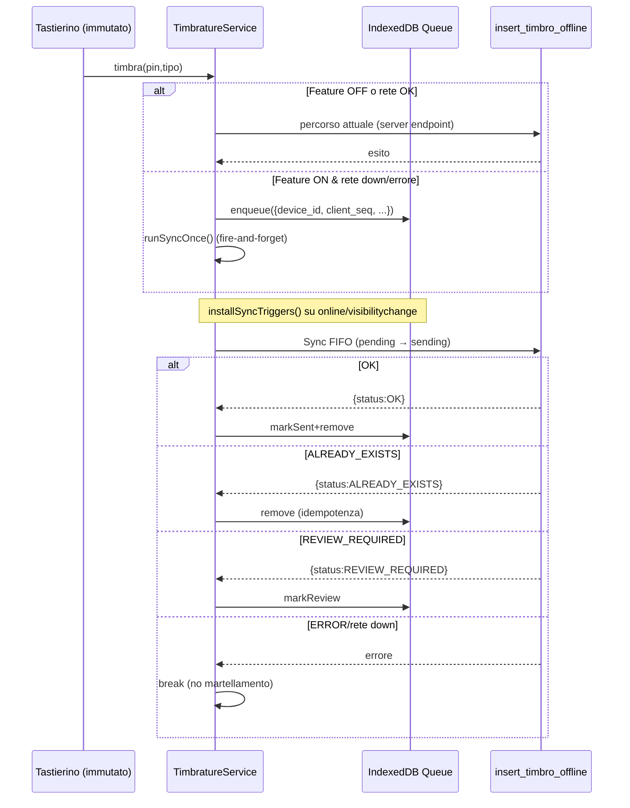

# BadgeNode — Offline Timbrature (Step 3 • Integrazione client reale con coda persistente + sync)

## Scopo
Abilitare operatività offline sul tablet unico: quando la rete manca/torna, le timbrature vengono messe in coda (IndexedDB) e sincronizzate verso `insert_timbro_offline` in modo idempotente. Nessun cambiamento alla UI.

## File creati/aggiornati
- `client/src/offline/idb.ts`
  - Wrapper IndexedDB minimal (DB `badgenode_offline`, store `timbri_v1`, keyPath `client_seq`).
  - API: `idbOpen`, `idbAdd`, `idbPut`, `idbGetAll`, `idbDelete`, `idbCount`.
- `client/src/offline/seq.ts`
  - Sequenza locale persistente per `client_seq` via `localStorage`.
  - API: `nextClientSeq`, `peekClientSeq`.
- `client/src/offline/types.ts`
  - Tipi: `QueueItem` (client_seq, device_id, pin, tipo, timestamp_raw, status, ...).
- `client/src/offline/queue.ts`
  - Coda persistente su IndexedDB.
  - API: `enqueue`, `getAllPending`, `markSending`, `markSent`, `markReview`, `remove`, `count`, `buildBaseItem`.
- `client/src/offline/syncRunner.ts`
  - `runSyncOnce()` FIFO verso Supabase REST RPC `insert_timbro_offline` (idempotente).
  - `installSyncTriggers()` per `online`/`visibilitychange` e tick DEV con backoff.
- `client/src/offline/diagnostic.ts`
  - Diagnostica arricchita: `queueCount` async, `peekClientSeq`.
- `client/src/main.tsx`
  - Import dinamici DEV: diagnostica + trigger sync quando flag OFFLINE è ON.
- `client/src/services/timbrature.service.ts`
  - Fallback offline: in assenza di rete o errore fetch → `enqueue()` e `runSyncOnce()`.
  - Debounce minimo 600ms quando flag ON; nessun cambio UI.

## Flusso (diagramma)


## API Coda (riassunto)
- `enqueue(base)` → `QueueItem` con `client_seq` assegnato, `status=pending`.
- `getAllPending()` → array ordinato per `client_seq`.
- `markSending/markSent/markReview/remove` → mutazioni per stato.
- `count()` → numero elementi (guardata dal flag).

## Fallback nel servizio
- Punto: `client/src/services/timbrature.service.ts` metodo `timbra(pin,tipo)`.
- Comportamento:
  - Flag OFF → percorso invariato.
  - Flag ON → se online prova percorso attuale, se errore di rete o offline → enqueue + `runSyncOnce()`.
  - Debounce 600ms per evitare doppio tap ravvicinato.

## Strategia retry/backoff
- Trigger automatici: `online` e `visibilitychange=visible`.
- Timer DEV con backoff lineare 10s → 30s (solo sviluppo) per evitare martellamento.

## Test manuali
- **Flag OFF**: tutto invariato.
- **Offline puro**: disattiva rete → 2 timbri (E/U) → nessun errore; `window.__BADGENODE_DIAG__.offline.getQueueCount()` = 2.
- **Ritorno rete**: torna online o foreground → coda svuotata, DB con 2 record (no duplicati).
- **Rete ballerina**: spegni rete durante invio → primo resta pending/sending; al ritorno riprende.
- **Idempotenza**: doppio tap ravvicinato → nessun duplicato (debounce + unique idx).
- **Alternanza**: due ENTRATA consecutive → seconda `REVIEW_REQUIRED`; le altre non bloccate.
- **Console**: log `[offline:*]` solo in DEV quando flag ON.

## Note
- Nessuna nuova dipendenza; file piccoli/modulari.
- Nessun cambiamento UI/UX; nessun wiring su componenti.
- La RPC e le RLS restano invariate; il runner le rispetta.

## Abilitazione in sviluppo
Aggiungi a `.env.local` e riavvia:
```bash
VITE_FEATURE_OFFLINE_QUEUE=true
```
Verifica in DevTools:
```js
window.__BADGENODE_DIAG__
```

