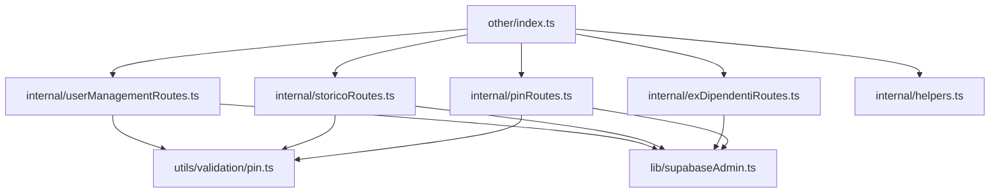
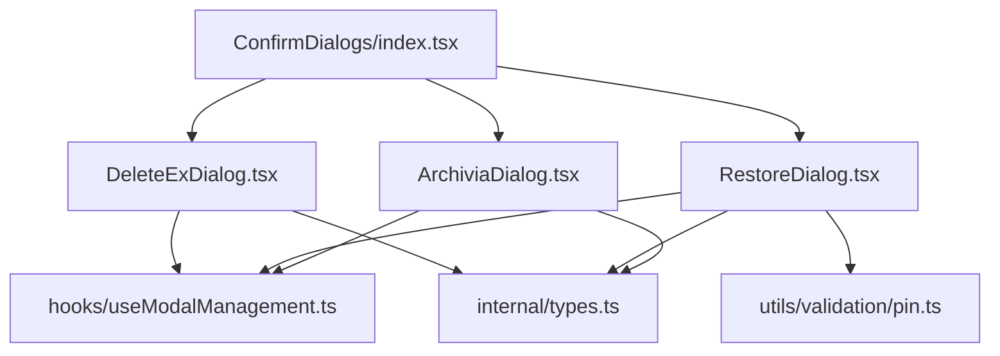

# PIANO SPLIT INCREMENTALE - File Critici BadgeNode
**Data**: 2025-10-26 23:07:00  
**Versione**: Enterprise v5.0  
**Obiettivo**: Riduzione complessità file >300 righe con approccio zero-risk  

---

## 📊 ROADMAP FILE CRITICI

### Target Files (Analisi attuale)

| File | Righe | Priorità | Complessità | Rischio Split | Target Righe | ETA |
|------|-------|----------|-------------|---------------|--------------|-----|
| `server/routes/modules/other.ts` | 611 | 🔴 ALTA | ALTA | MEDIO | <300 | Step 4 |
| `client/src/components/admin/ConfirmDialogs.tsx` | 487 | 🔴 ALTA | ALTA | ALTO | <300 | Step 5 |
| `client/src/hooks/useStoricoMutations.ts` | 310 | 🟡 MEDIA | MEDIA | MEDIO | <250 | Step 6 |
| `server/routes/timbrature/__tests__/postTimbratura.test.ts` | 294 | 🟢 BASSA | BASSA | BASSO | <250 | Step 7 |
| `client/src/services/utenti.service.ts` | 282 | 🟡 MEDIA | MEDIA | MEDIO | <250 | Step 6 |

---

## 🎯 MILESTONE ROADMAP

### **MILESTONE 1: Server Routes Optimization** (Step 4)
**Target**: `server/routes/modules/other.ts` (611 → <300 righe)

#### Sezioni Candidate per Split:
1. **PIN Validation Routes** (65 righe)
   - `/api/pin/validate` endpoint
   - Già parzialmente estratto in `internal/pinRoutes.ts`
   - **Rischio**: BASSO - Endpoint isolato

2. **Ex-Dipendenti Management** (85 righe)
   - `/api/ex-dipendenti/*` endpoints  
   - Già parzialmente estratto in `internal/exDipendentiRoutes.ts`
   - **Rischio**: BASSO - Feature isolata

3. **Storico API** (120 righe)
   - `/api/storico` endpoint con filtri complessi
   - **Rischio**: MEDIO - Logica business critica

4. **User Management Routes** (180 righe)
   - `/api/utenti/:id/archive`, `/api/utenti/:id/restore`
   - **Rischio**: ALTO - Operazioni critiche

5. **Utility Functions** (già estratte)
   - `computeDateStr`, `generateRequestId` ✅ FATTO

#### Strategia Split:
```
server/routes/modules/other/
├── index.ts (barrel exports, <100 righe)
├── internal/
│   ├── pinRoutes.ts ✅ (già creato)
│   ├── exDipendentiRoutes.ts ✅ (già creato)  
│   ├── storicoRoutes.ts (nuovo)
│   ├── userManagementRoutes.ts (nuovo)
│   └── helpers.ts ✅ (già creato)
```

#### Prerequisiti:
- [ ] Test coverage >80% per ogni sezione
- [ ] Smoke test per tutti gli endpoint
- [ ] Backup completo pre-split
- [ ] Rollback plan testato

---

### **MILESTONE 2: Admin Components Refactoring** (Step 5)
**Target**: `client/src/components/admin/ConfirmDialogs.tsx` (487 → <300 righe)

#### Sezioni Candidate per Split:
1. **DeleteExDialog Component** (130 righe)
   - Componente auto-contenuto
   - **Rischio**: MEDIO - State management complesso

2. **RestoreDialog Component** (140 righe)
   - Logica validazione PIN integrata
   - **Rischio**: ALTO - Business logic critica

3. **ArchiviaDialog Component** (120 righe)
   - Form handling e validazione
   - **Rischio**: MEDIO - UX critica

4. **Shared Types & Hooks** (50 righe)
   - Interfacce e utility condivise
   - **Rischio**: BASSO - Già estratte parzialmente

5. **Common Dialog Logic** (47 righe)
   - Modal management, focus trap, keyboard handling
   - **Rischio**: ALTO - Accessibilità critica

#### Strategia Split:
```
client/src/components/admin/ConfirmDialogs/
├── index.tsx (barrel exports, <100 righe)
├── DeleteExDialog.tsx (componente isolato)
├── RestoreDialog.tsx (componente isolato)
├── ArchiviaDialog.tsx (componente isolato)
├── hooks/
│   ├── useModalManagement.ts (focus, keyboard)
│   └── useDialogState.ts (state management)
├── internal/
│   └── types.ts ✅ (già creato)
```

#### Prerequisiti:
- [ ] **Test E2E completi** per ogni dialog
- [ ] **Accessibility audit** (WCAG AA)
- [ ] **Visual regression testing**
- [ ] **State management isolation** verificata

---

### **MILESTONE 3: Business Logic Optimization** (Step 6)
**Target**: `client/src/hooks/useStoricoMutations.ts` (310 → <250 righe)

#### Sezioni Candidate per Split:
1. **Mutation Handlers** (120 righe)
   - Create, update, delete operations
   - **Rischio**: ALTO - Data consistency critica

2. **Validation Logic** (80 righe)
   - Business rules validation
   - **Rischio**: ALTO - Logic business

3. **Error Handling** (60 righe)
   - Error normalization e user feedback
   - **Rischio**: MEDIO - UX importante

4. **Cache Management** (50 righe)
   - Query invalidation e optimistic updates
   - **Rischio**: ALTO - Performance critica

#### Strategia Split:
```
client/src/hooks/storico/
├── useStoricoMutations.ts (orchestrator, <150 righe)
├── mutations/
│   ├── useCreateMutation.ts
│   ├── useUpdateMutation.ts
│   └── useDeleteMutation.ts
├── validation/
│   └── storicoValidation.ts
└── cache/
    └── storicoCache.ts
```

#### Prerequisiti:
- [ ] **Unit tests** per ogni mutation
- [ ] **Integration tests** con React Query
- [ ] **Performance benchmarks**
- [ ] **Error boundary testing**

---

## 🔗 DEPENDENCY MAP

### Moduli Interni Suggeriti

#### Server-Side Dependencies:


#### Client-Side Dependencies:


### Re-Export Pattern Confermato:
```typescript
// Esempio: server/routes/modules/other/index.ts
export { pinRoutes } from './internal/pinRoutes';
export { exDipendentiRoutes } from './internal/exDipendentiRoutes';
export { storicoRoutes } from './internal/storicoRoutes';
export { userManagementRoutes } from './internal/userManagementRoutes';

// Mantiene compatibilità con import esistenti
export { default } from './otherRouter'; // Barrel router
```

---

## 🛡️ GATE DI SICUREZZA

### **Gate 1: Pre-Split Validation**
#### Prerequisiti Obbligatori:
- [ ] **Test Coverage** ≥80% per sezione target
- [ ] **Smoke Tests** passano per feature completa  
- [ ] **Dependency Analysis** completata (no circular deps)
- [ ] **Performance Baseline** stabilito
- [ ] **Backup Verified** e rollback testato

#### Criteri di Blocco:
- ❌ Test coverage <80%
- ❌ Circular dependencies rilevate
- ❌ Performance degradation >10%
- ❌ Breaking changes in public API

### **Gate 2: Post-Split Verification**
#### Validazioni Obbligatorie:
- [ ] **All Tests Pass** (unit + integration + e2e)
- [ ] **Build Success** senza warning
- [ ] **Runtime Stability** (no crashes per 24h)
- [ ] **Performance Maintained** (±5% baseline)
- [ ] **API Contracts Unchanged** (no breaking changes)

#### Criteri di Rollback:
- ❌ Qualsiasi test fallisce
- ❌ Performance degradation >5%
- ❌ Runtime errors o crashes
- ❌ Breaking changes rilevati

### **Gate 3: Production Readiness**
#### Checklist Finale:
- [ ] **Documentation Updated** (API docs, README)
- [ ] **Monitoring Setup** per nuovi moduli
- [ ] **Error Tracking** configurato
- [ ] **Rollback Plan** documentato e testato
- [ ] **Stakeholder Approval** ottenuto

---

## 📋 CHECKLIST PER MICRO-SPLIT

### **Fase Preparazione**
- [ ] **Identify Split Boundaries** (cohesion analysis)
- [ ] **Map Dependencies** (import/export analysis)
- [ ] **Create Test Plan** (coverage requirements)
- [ ] **Setup Monitoring** (performance baselines)
- [ ] **Prepare Rollback** (backup + restore procedure)

### **Fase Implementazione**  
- [ ] **Create Internal Modules** (atomic commits)
- [ ] **Extract Functions** (maintain signatures)
- [ ] **Setup Re-exports** (barrel pattern)
- [ ] **Update Imports** (internal references only)
- [ ] **Run Test Suite** (verify no regressions)

### **Fase Validazione**
- [ ] **TypeScript Check** (tsc --noEmit)
- [ ] **ESLint Validation** (no new warnings)
- [ ] **Unit Tests** (100% pass rate)
- [ ] **Integration Tests** (API contracts)
- [ ] **E2E Tests** (user workflows)

### **Fase Deployment**
- [ ] **Performance Validation** (load testing)
- [ ] **Security Audit** (no new vulnerabilities)
- [ ] **Documentation Update** (architecture docs)
- [ ] **Monitoring Setup** (alerts configured)
- [ ] **Production Deploy** (gradual rollout)

---

## ⚡ STIMA EFFORT & TIMELINE

### **Step 4: Server Routes** (other.ts)
- **Effort**: 8-12 ore
- **Rischio**: MEDIO
- **Beneficio**: Riduzione 50% complessità
- **Prerequisiti**: Test coverage server routes

### **Step 5: Admin Components** (ConfirmDialogs.tsx)  
- **Effort**: 12-16 ore
- **Rischio**: ALTO  
- **Beneficio**: Manutenibilità componenti
- **Prerequisiti**: E2E test completi, accessibility audit

### **Step 6: Business Logic** (useStoricoMutations.ts)
- **Effort**: 6-10 ore
- **Rischio**: ALTO
- **Beneficio**: Testabilità hooks
- **Prerequisiti**: React Query testing setup

### **Step 7: Test Files** (postTimbratura.test.ts)
- **Effort**: 4-6 ore  
- **Rischio**: BASSO
- **Beneficio**: Organizzazione test
- **Prerequisiti**: Test runner stabile

---

## 🎯 SUCCESS METRICS

### **Quantitative Metrics**
- **File Length**: Target <300 righe per file principale
- **Cyclomatic Complexity**: Riduzione 30-50%
- **Test Coverage**: Mantenimento ≥80%
- **Build Time**: Nessun incremento >10%
- **Bundle Size**: Nessun incremento significativo

### **Qualitative Metrics**  
- **Maintainability**: Facilità modifica singole feature
- **Testability**: Isolamento logica per unit testing
- **Readability**: Comprensibilità codice per nuovi developer
- **Modularity**: Riutilizzabilità componenti
- **Stability**: Zero regressioni funzionali

---

## 🚨 RISK MITIGATION

### **High-Risk Areas**
1. **State Management** (React hooks, cache)
2. **Business Logic** (validation, calculations)  
3. **User Interface** (accessibility, UX flows)
4. **API Contracts** (backward compatibility)

### **Mitigation Strategies**
1. **Gradual Rollout** (feature flags)
2. **Comprehensive Testing** (unit + integration + e2e)
3. **Performance Monitoring** (real-time alerts)
4. **Rollback Automation** (one-click revert)

---

**Piano generato**: 2025-10-26 23:07:00  
**Prossimo step**: Implementazione Milestone 1 (Server Routes)  
**Approccio**: Zero-risk, incrementale, test-driven
