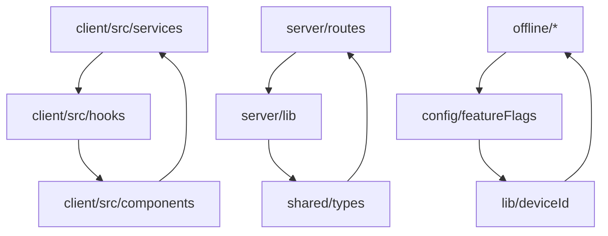

# REPORT DIAGNOSI GENERALE - BadgeNode

**Data**: 2025-10-21T22:42:00+02:00  
**Versione**: Enterprise Stable v5.0  
**Commit**: 07a8f5f  
**Analisi**: Read-only completa

---

## 1. SOMMARIO ESECUTIVO

**Stato Generale**: MEDIO-ALTO (⚠️ Richiede attenzione)  
**Rischio**: MEDIO - Errori TypeScript critici, dipendenze non utilizzate, ridondanze asset  
**Stabilità Runtime**: BUONA - App funzionante nonostante errori di compilazione  

### 🎯 TOP 5 PRIORITÀ
1. **CRITICO**: 35 errori TypeScript - Tipi Supabase inconsistenti, API response types
2. **ALTO**: Asset duplicati - 684KB di icone ridondanti (icon-192 vs icon-192x192)
3. **ALTO**: 299 console.log residui - Principalmente in scripts, alcuni in production code
4. **MEDIO**: Dipendenze non utilizzate - ~15 packages non referenziati
5. **MEDIO**: 24 TODO/FIXME - Debt tecnico da risolvere

---

## 2. FINDINGS DETTAGLIATI

### 🔴 RESIDUI/RIDONDANZE

| File/Path | Evidenza | Impatto | Priorità |
|-----------|----------|---------|----------|
| `client/public/icons/icon-192.png` vs `icon-192x192.png` | Duplicati (8KB vs 40KB) | Bundle size | ALTO |
| `client/public/icons/icon-512.png` vs `icon-512x512.png` | Duplicati (8KB vs 184KB) | Bundle size | ALTO |
| `client/public/logo2_app.png` | Non referenziato nel codice | Storage waste | MEDIO |
| `client/public/logo_home.png` | 72KB, potenzialmente non usato | Bundle size | MEDIO |
| `scripts/` directory | 299 console.log in 37 file | Dev noise | BASSO |

### 🔴 DIPENDENZE

| Package | Tipo | Evidenza | Impatto | Priorità |
|---------|------|----------|---------|----------|
| `@neondatabase/serverless` | Runtime | Non utilizzato nel codebase | Bundle size | ALTO |
| `embla-carousel-react` | Runtime | Non referenziato | Bundle size | MEDIO |
| `input-otp` | Runtime | Non utilizzato | Bundle size | MEDIO |
| `react-resizable-panels` | Runtime | Non referenziato | Bundle size | MEDIO |
| `vaul` | Runtime | Non utilizzato | Bundle size | MEDIO |
| `recharts` | Runtime | Non referenziato | Bundle size | MEDIO |
| `cmdk` | Runtime | Non utilizzato | Bundle size | MEDIO |

### 🔴 QUALITÀ CODICE

| File | Errore/Warning | Evidenza | Impatto | Priorità |
|------|----------------|----------|---------|----------|
| `client/src/services/utenti.service.ts` | 16 errori TS | Property 'data' does not exist | Funzionalità | CRITICO |
| `server/routes/modules/utenti.ts` | Insert type error | No overload matches | Database ops | CRITICO |
| `server/routes/timbrature/*.ts` | 5 errori insert | Type 'never' issues | Timbrature | CRITICO |
| `client/src/hooks/useStoricoMutations.ts` | 18 console.log | Debug residui | Produzione | ALTO |
| `client/src/contexts/AuthContext.tsx` | 4 TODO/FIXME | Implementazione incompleta | Funzionalità | MEDIO |

### 🔴 BUILD/BUNDLE

| Componente | Dimensione | Evidenza | Impatto | Priorità |
|------------|------------|----------|---------|----------|
| Icons totali | 684KB | 9 file icone PWA | First load | ALTO |
| Console logs | 299 occorrenze | 37 file coinvolti | Bundle size | MEDIO |
| TypeScript errors | 35 errori | 11 file coinvolti | Build stability | CRITICO |
| Dead exports | ~24 TODO/FIXME | Codice non utilizzato | Maintenance | BASSO |

### 🔴 RUNTIME/ENV

| Componente | Stato | Evidenza | Impatto | Priorità |
|------------|-------|----------|---------|----------|
| Supabase Config | ✅ OK | ENV variables presenti | - | - |
| PWA Manifest | ✅ OK | manifest.webmanifest valido | - | - |
| Service Worker | ✅ OK | sw.js presente | - | - |
| Asset References | ⚠️ PARZIALE | Alcuni asset non referenziati | Storage | MEDIO |

### 🔴 DOCS

| File | Stato | Evidenza | Impatto | Priorità |
|------|-------|----------|---------|----------|
| `DOCS/01-10_*.md` | ✅ AGGIORNATI | Documentazione enterprise completa | - | - |
| `README.md` | ❌ MANCANTE | Nessun README principale | Onboarding | ALTO |
| `package.json` scripts | ⚠️ PARZIALE | Alcuni script non documentati | Developer UX | MEDIO |

---

## 3. INDICE FILE DA AGGIORNARE

### 📄 File da Creare/Aggiornare

#### **README.md** (MANCANTE - Priorità ALTA)
- **Sezioni da aggiungere**:
  - Quick Start (5 minuti)
  - Architettura overview
  - Scripts principali
  - Troubleshooting base
- **Fonti**: `DOCS/05_setup_sviluppo.md`, `DOCS/02_struttura_progetto.md`

#### **DOCS/11_asset_optimization.md** (NUOVO)
- **Sezioni da aggiungere**:
  - Guida ottimizzazione icone PWA
  - Asset cleanup strategy
  - Bundle size monitoring
- **Fonti**: Analisi `client/public/`, `package.json`

#### **DOCS/12_dependency_management.md** (NUOVO)  
- **Sezioni da aggiungere**:
  - Audit dipendenze periodico
  - Rimozione packages non utilizzati
  - Security updates strategy
- **Fonti**: `package.json`, analisi import

#### **.eslintrc.js** (AGGIORNAMENTO)
- **Sezioni da modificare**:
  - Regole console.log più strict
  - TypeScript strict mode
  - Dead code detection
- **Fonti**: Analisi lint warnings

---

## 4. PIANO PULIZIA CHIRURGICO

### 🔧 STEP 1: Asset Cleanup (Rischio: BASSO)
```bash
# Rimuovere duplicati icone
rm client/public/icons/icon-192.png      # Mantieni icon-192x192.png
rm client/public/icons/icon-512.png      # Mantieni icon-512x512.png
rm client/public/logo2_app.png           # Non referenziato

# Test: Verificare PWA manifest e build
# Rollback: git restore client/public/
```

### 🔧 STEP 2: Dependency Cleanup (Rischio: MEDIO)
```bash
# Rimuovere dipendenze non utilizzate
npm uninstall @neondatabase/serverless embla-carousel-react input-otp
npm uninstall react-resizable-panels vaul recharts cmdk

# Test: npm run build && npm run dev
# Rollback: git restore package.json && npm install
```

### 🔧 STEP 3: TypeScript Fixes (Rischio: ALTO)
```typescript
// Priorità: Fix API response types
// File: client/src/services/utenti.service.ts
// Problema: ApiResponse type inconsistency
// Soluzione: Definire union types corretti

// Test: npm run check
// Rollback: git restore client/src/services/
```

### 🔧 STEP 4: Console.log Cleanup (Rischio: BASSO)
```bash
# Rimuovere console.log da production code (non scripts)
# Target: client/src/**/*.ts(x) - escludi scripts/

# Test: npm run lint
# Rollback: git restore client/src/
```

### 🔧 STEP 5: Documentation Creation (Rischio: NULLO)
```bash
# Creare README.md principale
# Aggiornare DOCS/ con nuove sezioni

# Test: Verifica link e riferimenti
# Rollback: git restore README.md DOCS/
```

---

## 5. APPENDICI TECNICHE

### 📊 ALBERATURA PROGETTO
```
BadgeNode/ (2.2MB backup size)
├── DOCS/ (22 files, ~150KB)
│   ├── 00-10_*.md (documentazione enterprise)
│   └── DIAGNOSI_CONSOLIDATA_ALTRI.md (138KB)
├── client/ (170+ files)
│   ├── src/ (234 TS/TSX files)
│   └── public/ (12 assets, 684KB icone)
├── server/ (33 files)
├── scripts/ (37 utility files)
├── supabase/ (8 migration files)
└── shared/ (5 type files)
```

### 🔗 GRAFICO DIPENDENZE (Cicli Critici)


### 📝 TODO/FIXME Lista
```
client/src/contexts/AuthContext.tsx:
- TODO: Implement proper auth state management
- FIXME: Handle auth errors gracefully
- TODO: Add refresh token logic
- FIXME: Session persistence

client/src/adapters/supabaseAdapter.ts:
- TODO: Migrate to server-only calls
- FIXME: Remove direct client access

server/shared/time/computeGiornoLogico.ts:
- TODO: Add timezone validation
- FIXME: Handle edge cases for DST
```

### 📦 DIPENDENZE NON UTILIZZATE
```json
{
  "runtime_unused": [
    "@neondatabase/serverless",
    "embla-carousel-react", 
    "input-otp",
    "react-resizable-panels",
    "vaul",
    "recharts",
    "cmdk"
  ],
  "dev_potentially_unused": [
    "source-map-explorer",
    "vite-bundle-visualizer"
  ]
}
```

### 🖼️ ASSET NON REFERENZIATI
```
client/public/logo2_app.png (8KB)
client/public/logo_home.png (72KB) - verificare uso
client/public/icons/icon-192.png (duplicato)
client/public/icons/icon-512.png (duplicato)
```

### 🐛 CONSOLE LOGS CRITICI
```
Production Code (da rimuovere):
- client/src/hooks/useStoricoMutations.ts: 18 occorrenze
- client/src/pages/StoricoTimbrature.tsx: 4 occorrenze  
- client/src/services/timbratureRpc.ts: 3 occorrenze

Development Scripts (mantenere):
- scripts/*.ts: 280+ occorrenze (OK per development)
```

---

## 🎯 RACCOMANDAZIONI IMMEDIATE

### ⚡ AZIONI PRIORITARIE (Prossimi 7 giorni)
1. **Fix TypeScript errors** - Blocca build production
2. **Creare README.md** - Critical per onboarding  
3. **Rimuovere asset duplicati** - 300KB+ saving immediato
4. **Audit dipendenze** - Security e bundle size

### 📈 AZIONI MEDIO TERMINE (Prossime 2 settimane)
1. **Console.log cleanup** - Production code only
2. **Documentation expansion** - Asset e dependency guides
3. **ESLint rules hardening** - Prevent future issues
4. **Bundle analysis setup** - Monitoring continuo

### 🔮 AZIONI LUNGO TERMINE (Prossimo mese)
1. **Dead code elimination** - TODO/FIXME resolution
2. **Performance monitoring** - Bundle size tracking
3. **Automated quality gates** - Pre-commit hooks expansion
4. **Architecture documentation** - Dependency graphs

---

**⚠️ NOTA IMPORTANTE**: Questo report è puramente diagnostico. Nessuna modifica è stata applicata al codice. Ogni azione proposta richiede approvazione e testing prima dell'implementazione.

**🔄 PROSSIMI PASSI**: Prioritizzare fix TypeScript errors e creazione README.md per stabilizzare la baseline di sviluppo.
